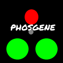

<div align="center">

## Phosgene

<h8>Logo designed by lmsdscav</h8>
</div>

## Features
 - **Fork of [Leaf](https://github.com/Winds-Studio/Leaf)
 - No fixes

## Contact

- QQ: 2577219357


## Downloads

The Reobf JAR can be obtained in the [Releases](https://github.com/lmsdscav/Phosgene/releases)


## Building

Building a Paperclip JAR for distribution:

```bash
./gradlew applyPatches && ./gradlew createReobfPaperclipJar
```


## License

Paperweight files are licensed under MIT.
Patches are licensed under MIT, unless indicated differently in their header.
Binaries are licensed under GPL-3.0.

Also see [PaperMC/Paper](https://github.com/PaperMC/Paper) and [PaperMC/Paperweight](https://github.com/PaperMC/paperweight) for the license of some material used by this project.

Credits:
-------------
All authors that Leaf thanked we will also thank.

- [Leaf](https://github.com/Winds-Studio/Leaf)
- [Gale](https://github.com/GaleMC/Gale)
- [Pufferfish](https://github.com/pufferfish-gg/Pufferfish)
- [Purpur](https://github.com/PurpurMC/Purpur)
- [KeYi](https://github.com/KeYiMC/KeYi) (R.I.P.) [(Backup)](https://github.com/MikuMC/KeYiBackup)
- [KTP](https://github.com/lynxplay/ktp)
- [Mirai](https://github.com/etil2jz/Mirai)
- [Petal](https://github.com/Bloom-host/Petal)
- [Carpet Fixes](https://github.com/fxmorin/carpet-fixes)
- [Slice](https://github.com/Cryptite/Slice)
- [Parchment](https://github.com/ProjectEdenGG/Parchment)
- [Leaves](https://github.com/LeavesMC/Leaves)
- [Kaiiju](https://github.com/KaiijuMC/Kaiiju)
